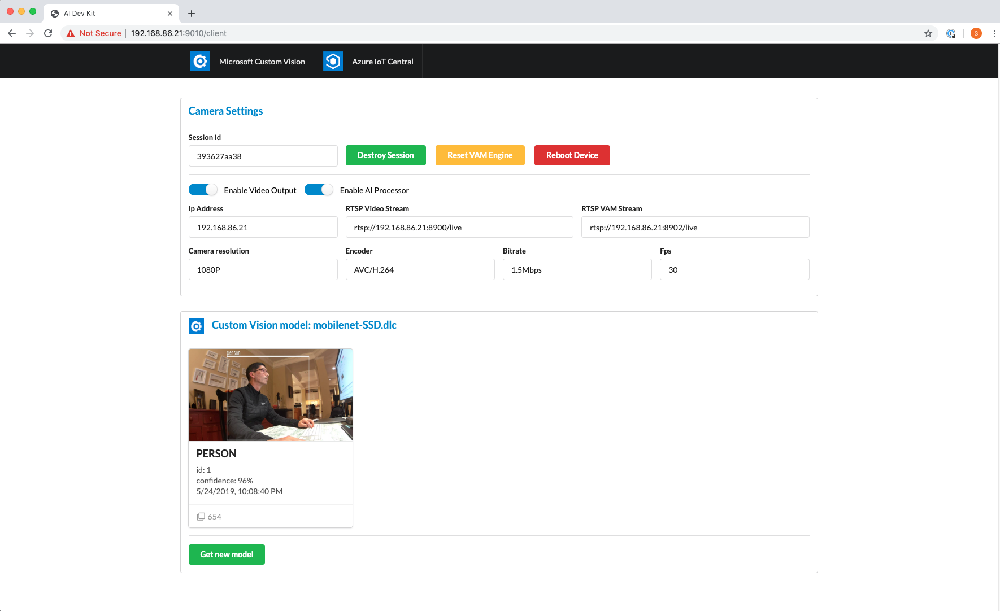

# Vision AI DevKit Sample
This project is an example module for the Vision AI DevKit device. With this sample you will be able to experiment with Custom Vision AI models without writing any code.

This project is also an example implementation of how a device provisions itself with Azure IoT Central and also includes a full implementation of how a device participates with the Azure IoT Central platform includeing telementry, state, events, and settings, properites, and custom commands. You can even update your AI vision model from your IoT Central app. See the full documentation overview of Azure IoT Central here: [Azure IoT Central Documentation](https://docs.microsoft.com/en-us/azure/iot-central/). This integration with Azure IoT Central is optional and controlled by an environment variable.

This project is implemented as a NodeJS micro service and React Web client. The web client allows the user to interact directly with the device to control it as well as experiment with Custom Vision AI models. The companion React web client project can be found here *[peabody-local-client](https://github.com/sseiber/peabody-local-client)*. A static version of the web client bundle is included in the `./client_dist` folder.

The project includes a Dockerfile and scripts used to build the docker container.

## Dependencies
  * [Visual Studio Code](https://code.visualstudio.com/download)
    * Not exactly but you should really be using this excellent IDE
  * [NodeJS 10x (with NPM)](https://nodejs.org/en/download/)
    * This is the official link but it's probably easier to get it from your package manager like Brew, Chocolatey, etc.
  * [Android Device Bridge tools (ADB)](https://developer.android.com/studio/command-line/adb)
    * This is the Android Device Bridge tool. It lets you physicaly connect to the device over a USB cable to manage, copy files, debug, etc. If you are familiar with Android mobile development you know about this tool. The Vision AI DevKit hardware architecture has some roots in Android and Qualcomm which is related to the use of this tool for the development cycle. You can install this tool separately or if you already installed Android Studio for Android mobile development you already have this tool.
    * This is only a dependency for inspecting/managing the camera directly in development scenarios.
  * Get a [Vision AI DevKit camera device](https://azure.github.io/Vision-AI-DevKit-Pages/)
    * Follow the instructions to set it up via the WiFi Out-Of-Box-Experience and connect it to Azure IoT Edge
    * While you are following the setup sequence, note the ip address of your device on the local network.
    * If you missed it you can use the `adb` tool from the command line by running the following command:  
      ```
      adb shell ifconfig wlan0
      ```
  * Remove the sample module that came with Vision AI Dev Kit
    * The instructions for Vision AI Dev Kit it will provision a sample module to be deployed to the device from Azure IoT Hub. This sample project will replace the module that came with Vision AI Dev Kit.
    * Using the (Azure Portal)[www.portal.azure.com] online locate the Azure IoT Hub that was provisioned in your subscription during the Vision AI Dev Kit setup instructions.
    * Select IoT Edge on the left pane, then select the IoT Edge Device tab.
    * You should see your Vision AI Dev Kit device. Select the device then select Set Modules at the top of the screen. You can delete the sample module provisioned by Vision AI Dev Kit.
    * Remember this screen when you want to configure a new module deployment later.

## There are 3 ways to experiment with and develop code for Vision AI Dev Kit:
1. ### Local development with code running in VSCode and controlling the camera over the network
1. ### Run your Docker container manually right on the device
1. ### Publish your Docker container and deploy it with Azure IoT Edge

### 1. Local development

#### &nbsp;&nbsp;&nbsp;&nbsp;&nbsp;Environment installation
  * Build the local web client and start the web dev server
    * `git clone https://github.com/sseiber/peabody-local-client`
    * `cd peabody-local-client`
    * `npm i`
    * `npm start`
  * Build local service
    * `clone https://github.com/sseiber/iotc-pnp-aidevkit-module`
    * `cd iotc-pnp-aidevkit-module`
    * `npm i`
    * Open VSCode on this folder. You can use the command:
        ```
        code .
        ```
    * In the `./configs/local.json` file update the `cameraIpAddress` field using your own camera's IP address:  
        ```
        {
            "cameraIpAddress": "<your camera ip address>",
            "hostIpAddress": "localhost"
        }
        ```
        * This will tell the code where it should find the camera on your local network. Make sure your computer and the camera are on the same network. Since the Vision AI DevKit interface is REST we can run the web client/server experience locally on a development machine and still control the camera over the network. This is a better developent cycle than building a Docker container and deploying over and over.
    * In order for the camera to run a video models we need to copy a video model to it. The Vision AI Dev device should already have been provisioned with a video model if you followed the setup instructions. But just to be sure you can check that the `/data/misc/camera` folder on the camera itself. Use the following command in a terminal window:
        ```
        adb shell ls /data/misc/camera
        ```
        You should see files that look something like this:
        ```
        aecWarmStartCamera_0.txt
        labels.txt
        model.dlc
        va-snpe-engine-library_config.json
        ```
    * Press F5 (to start with the debugger)
    * You should see output that looks like this:
       ```
       [05:59:36 GMT-0700], [log,[InferenceProcessor, info]] data: Inference: id:2 "person" 88%
       [05:59:37 GMT-0700], [log,[InferenceProcessor, info]] data: Inference: id:2 "person" 94%
       [05:59:39 GMT-0700], [log,[InferenceProcessor, info]] data: Inference: id:2 "person" 90%
       [05:59:41 GMT-0700], [log,[InferenceProcessor, info]] data: Inference: id:2 "person" 89%
       [05:59:43 GMT-0700], [log,[InferenceProcessor, info]] data: Inference: id:2 "person" 90%
       ```
    * You can also use the web client by navigating your browser to `http://<camera-ip-address>:9010/client`. You should see a web client that looks like this:

      

      Using the web client you can view inferences detected by the vision model running on the Vision AI Dev Kit. Also using the [Microsoft Custom Vision](https://azure.microsoft.com/en-us/services/cognitive-services/custom-vision-service/) service you can build and train your own vision model and export it directly to the Vision AI Dev Kit. Using the web client you can swap your video model with one that you exported from the [Microsoft Custom Vision](https://azure.microsoft.com/en-us/services/cognitive-services/custom-vision-service/) service.

## Build a Docker container and run in manually
  * Build the project in a Docker container
    * The package.json for this project contains a dockerbuild script entry. This uses a build script in the ./scripts directory along with the Dockerfile. It also looks for a tag name in the `./configs/imageName.json` file.
    * Open the `./configs/imageName.json` and update the imageName field to your own container registry and image name.
  * Run the command:
      ```
      npm run dockerbuild
      ```
  * When the build completes it should have build the docker container and pushed it to your container registry.
  * Now switch to your Vision AI Dev Kit shell with `adb shell` and run the following commands on the device.
    ```
    docker login <your container registry> pw: <your container registry password>
    ```
    You will only need to so this once. The container registry address and password will be cached in Docker.

  * Run the following command to start the Docker image:
    ```
    docker run \
        -it \
        --rm \
        -e videoCaptureSource=rtsp \
        --network=host \
        -v /run/systemd:/run/systemd \
        -v /var/run/docker.sock:/var/run/docker.sock \
        -v /data/misc:/data/misc \
        -v /etc/version:/etc/version \
        -v /sys/class/power_supply:/sys/class/power_supply \
        <your-container-registry>/<your-docker-imagename>:<version-tag> \
        node ./dist/index.js
    ```

## Publish your Docker container and deploy it from IoT Edge
  * Using the (Azure Portal)[www.portal.azure.com] online go to your Azure IoT Hub that was provisioned in your subscription during the Vision AI Dev Kit setup instructions.
  * Select IoT Edge on the left pane, then select the IoT Edge Device tab.
  * You should see your Vision AI Dev Kit device. Select the device then select Set Modules at the top of the screen.
  * Add the details about you Docker container here:
    * Container Registry Settings
    * Under Deployment Modules slect +Add and select "IoT Edge Module"
    * On the right pain enter the following information:
      * A descriptive name
      * The full Docker container image uri (e.g. container-registry/image-name:version-tag)
      * These environment variables:
        | Name | Value |
        | --- | --- |
        | videoCaptureSource | rtcp |
      * Container Create Options
        ```
        {
            "HostConfig": {
                "PortBindings": {
                    "9010/tcp": [
                        {
                            "HostPort": "9010"
                        }
                    ]
                },
                "Binds": [
                    "/run/systemd:/run/systemd",
                    "/var/run/docker.sock:/var/run/docker.sock",
                    "/data/misc:/data/misc",
                    "/etc/version:/etc/version",
                    "/sys/class/power_supply:/sys/class/power_supply:"
                ],
                "NetworkMode": "host"
            },
            "NetworkingConfig": {
                "EndpointsConfig": {
                    "host": {}
                }
            }
        }
        ```
      * Click Save and Next, Next, Submit
      * In a few minutes your container should deploy to your Vision AI Dev Kit

## Development
  * Test scripts can be run with this command
    ```
    npm run test
    ```

  * Manual lint checks can be run with this command
    ```
    npm run tslint
    ```

  * Build a new docker image after with a new package.json version number:
    ```
    npm version [major|minor|patch] [--force]
    ```
    *this assumes access to the container registry for the image being built*

## Azure IoT Central

This project includes support for connecting to [Azure IoT Central](https://azure.microsoft.com/en-us/services/iot-central/) and sending telemetry, state, events, and supports running commands sent from your IoT Central app.

  * Create an Azure IoT Central app
    * [Click on this link to create an IoT Central App for the Vision AI Dev Kit](https://apps.azureiotcentral.com/create?appTemplate=0098b855-6bbd-49db-9945-d72edfd907ce)
    * You can create a Pay-As-You-Go instance or a Trial instance

  * Provision your camera with a Device Id and Device Key
    * This step requires you to create a Device SAS Key and you will need the primary access key from your Azure IoT Central app.  
      * Open your Azure IoT Central app
      * On the left side select Administration
      * Select Device connection
      * Write down the ScopeID (for use later)
      * Set the Auto Approve setting to Enabled
      * Set the Device Enrollment setting to Enabled
      * Write down the Primary Key (for use with the dps-keygen tool)
      * Using the [dps-keygen](https://github.com/Azure/dps-keygen) tool run the command:
        ```
        dps-keygen -mk:primarykey -di:deviceid
        ```
        Use a unique deviceid that you create. The output of this command will be the Device SAS key and will be associated with your Azure IoT Central application and your device (e.g. deviceid).
      * Copy these two values to the file in `./peabody/storage/state.json` and update the `deviceId` and `deviceKey` values.
      * Copy this file to your Vision AI Dev Kit's filesystem at `/data/misc/storage`. Use the command:
        ```
        adb copy ./peabody/storage/state.json /data/misc/storage
        ```
      * Add the additional environment variables listed below to the Edge Module (for Azure IoT Hub deployments). Note that your `template-id` and your `template-version` can be retrieved from you Azure IoT Central app (Select Device Explorer and just below the title you will see the `templateid/templateversion` along with a copy button).
        | Name | Value |
        | --- | --- |
        | enableIoTCentralProvisioning | 1 |
        | videoCaptureSource | rtsp |
        | iotCentralScopeId | your-scope-id |
        | iotCentralDcmid | your-dcmid-id |

      Optionally you can run the Docker continer manually directly on the Vision AI Dev Kit (via the adb shell) with the following command:
      ```
      docker run \
          -it \
          --rm \
          -e enableIoTCentralProvisioning=1 \
          -e videoCaptureSource=rtsp \
          -e iotCentralScopeId=<your-scope-id> \
          -e iotCentralDcmid=<your-dcm-id> \
          --network=host \
          -v /run/systemd:/run/systemd \
          -v /var/run/docker.sock:/var/run/docker.sock \
          -v /data/misc:/data/misc \
          -v /etc/version:/etc/version \
          -v /sys/class/power_supply:/sys/class/power_supply \
          <your-container-registry>/<your-docker-imagename>:<version-tag> \
          node ./dist/index.js
      ```
      After the Docker container starts you can examine the logs to verify that it has correctly provisioned with your Azure IoT Central App. You should see something like this:
        ```
        [06:28:02 GMT+0000], [log,startup,info] data:  > Machine: linux, 4 core, freemem=1050mb, totalmem=1828mb
        [06:28:02 GMT+0000], [log,startup,info] data: 👨‍💻 Starting IoT Central provisioning
        [06:28:02 GMT+0000], [log,[IoTCentralService, info]] data: Enabling DPS provisioning through IoT Central: "enableIoTCentralProvisioning=1"
        [06:28:02 GMT+0000], [log,[IoTCentralService, info]] data: Starting IoT Central provisioning for device: peabody-home
        [06:28:04 GMT+0000], [log,[IoTCentralService, info]] data: IoT Central dps request succeeded - waiting for hub assignment
        [06:28:07 GMT+0000], [log,[IoTCentralService, info]] data: IoT Central dps request succeeded - waiting for hub assignment
        [06:28:08 GMT+0000], [log,[IoTCentralService, info]] data: IoT Central dps hub assignment: iotc-fde292d1-90e2-4564-a5b7-4bb558dde379.azure-devices.net
        [06:28:09 GMT+0000], [log,[CameraService, info]] data: Handle setting change for setting_hdmi_output: true
        [06:28:09 GMT+0000], [log,[IoTCentralService, info]] data: Device live properties updated
        [06:28:09 GMT+0000], [log,startup,info] data: 👩‍💻 Finished IoT Central provisioning
        [06:28:09 GMT+0000], [log,startup,info] data: 📁 Starting Docker image provisioning
        [06:28:09 GMT+0000], [log,[FileHandler, info]] data: Provisioning docker imgage
        [06:28:09 GMT+0000], [log,[IoTCentralService, info]] data: Device live properties updated
        [06:28:09 GMT+0000], [log,[InferenceProcessor, info]] data: Handle setting change for setting_inference_threshold: 80
        [06:28:09 GMT+0000], [log,[IoTCentralService, info]] data: Device live properties updated
        [06:28:09 GMT+0000], [log,[IoTCentralService, info]] data: Device live properties updated
        [06:28:09 GMT+0000], [log,[InferenceProcessor, info]] data: Handle setting change for setting_detect_class: person
        [06:28:09 GMT+0000], [log,[FileHandler, info]] data: Found existing version file: 1.0.127, new image is: 1.0.127
        [06:28:09 GMT+0000], [log,[IoTCentralService, info]] data: Device event message sent
        [06:28:09 GMT+0000], [log,[IoTCentralService, info]] data: Device live properties updated
        [06:28:09 GMT+0000], [log,[IoTCentralService, info]] data: Device live properties updated
        [06:28:09 GMT+0000], [log,startup,info] data: 📁 Finished Docker image provisioning
        ```

      Telemetry should look like this:

        ```
        [06:28:20 GMT+0000], [log,[InferenceProcessor, info]] data: Inference: id:1 "person" 88%
        [06:28:21 GMT+0000], [log,[InferenceProcessor, info]] data: Inference: id:1 "person" 85%
        [06:28:23 GMT+0000], [log,[InferenceProcessor, info]] data: Inference: id:1 "person" 94%
        [06:28:24 GMT+0000], [log,[InferenceProcessor, info]] data: Inference: id:1 "person" 66%
        [06:28:24 GMT+0000], [log,[IoTCentralService, info]] data: Device telemetry message sent
        [06:28:24 GMT+0000], [log,[IoTCentralService, info]] data: Device event message sent
        [06:28:26 GMT+0000], [log,[InferenceProcessor, info]] data: Inference: id:1 "person" 95%
        [06:28:26 GMT+0000], [log,[IoTCentralService, info]] data: Device telemetry message sent
        [06:28:26 GMT+0000], [log,[IoTCentralService, info]] data: Device event message sent
        ```
      In your Azure IoT Central App you should begin to see telemetry flowing in:

        

## Reset your device and go back to the shipping sample
If you want to revert back to the shipping sample module press the power button on the back of the device for 5-6 seconds. Next, follow the instructions online for the [Vision AI Dev Kit](https://www.visionaidevkit.com/)
